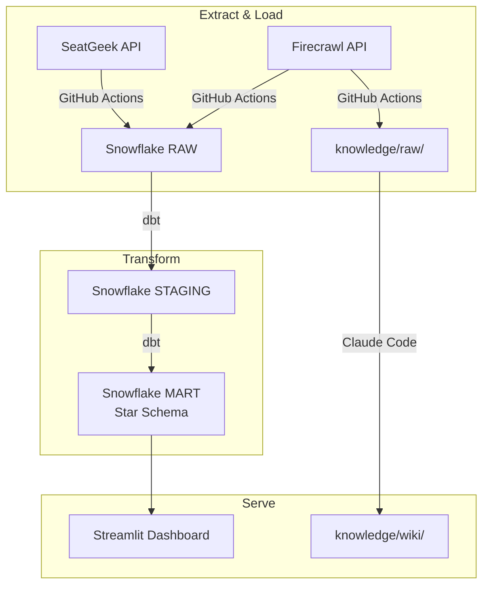
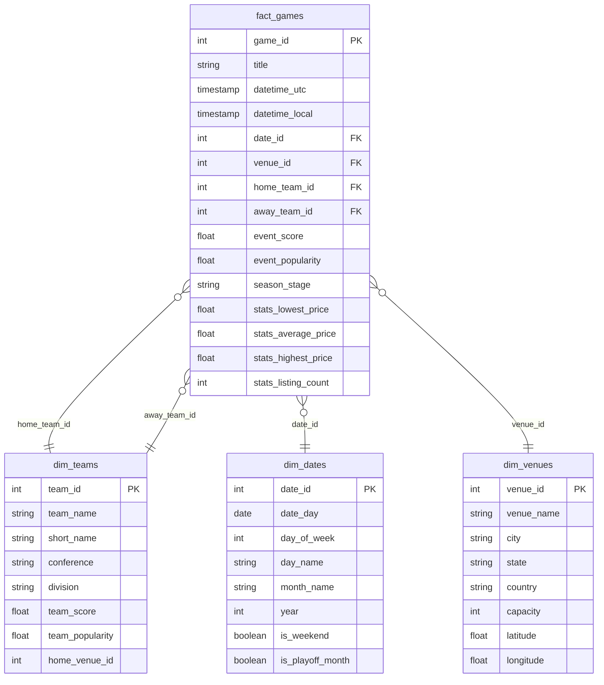

# NHL Opponent & Schedule Intelligence Tool

An end-to-end data pipeline and analytics tool for NHL game scheduling, demand analysis, and ticket pricing intelligence. Built to demonstrate SQL, data pipelines, dimensional modeling, and demand/pricing analysis skills targeting the LA Kings Sr. Data Analyst role at AEG.

## Tech Stack

| Layer | Tool |
|---|---|
| Data Warehouse | Snowflake (AWS US East 1) |
| Transformation | dbt |
| Orchestration | GitHub Actions |
| Dashboard | Streamlit (deployed to Streamlit Community Cloud) |
| Knowledge Base | Claude Code (scrape, synthesize, query) |
| Languages | Python, SQL |

## Data Sources

1. **SeatGeek API** — NHL game events, team metadata, venue information, ticket pricing
2. **Firecrawl Web Scrape** — Sports business articles, AEG/Kings content, dynamic pricing research

## Data Pipeline



## Star Schema (ERD)



## Setup & Reproduction

### Prerequisites

- Python 3.11+
- Snowflake account (AWS US East 1)
- SeatGeek API key
- Firecrawl API key

### Installation

```bash
git clone https://github.com/beckettyee/analytics-engineer-nhl.git
cd analytics-engineer-nhl
pip install -r requirements.txt
```

### Configuration

1. Copy `.env.example` to `.env` and fill in credentials
2. Generate Snowflake key pair (see extract/README or .env.example)
3. Run Snowflake setup: `python extract/snowflake_setup.py`
4. Run extract: `python extract/seatgeek_extract.py`
5. Run dbt: `cd dbt_project && dbt run && dbt test`
6. Run dashboard: `cd streamlit && streamlit run app.py`

## Insights Summary

- **Schedule patterns:** NHL playoff games cluster in April-June with higher event scores
- **Demand drivers:** Team popularity, venue market size, and day of week influence event demand
- **Pricing intelligence:** Ticket prices correlate with event popularity and team matchup strength

## Knowledge Base

Query the knowledge base by running Claude Code against this repo. Wiki pages in `knowledge/wiki/` synthesize insights from 15+ scraped sources about the LA Kings, AEG, and dynamic pricing trends.
